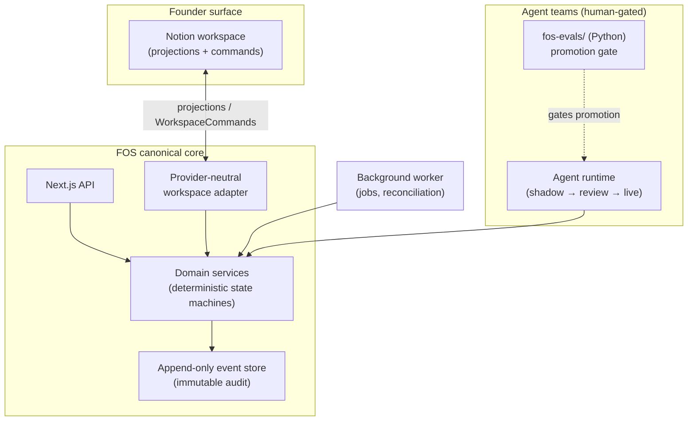

# Founder Operating System (FOS)

**An agentic operating system for a solo founder running a portfolio of products.**

FOS is the canonical system of record, reasoning layer, and automation engine for a founder's company. It owns evidence, claims, consent, approvals, an immutable event log, and analytics — and drives a set of LLM **agent teams** (spec-writing, QA/release, competitive research, marketing/comms, chief-of-staff) under human approval gates. The founder works in **Notion** (a provider-neutral workspace _adapter_); FOS keeps the truth.

> **Status (2026-07-16):** Architecture, verified spec review, and decision record complete. Implementation begins at **Phase 0** (canonical core). No application code yet — this repo currently holds the specs, the decision record, and the build plan. Progress lands as PR-per-slice, each gated by two adversarial verifiers (see _How this is built_).

---

## Why this repo is unusual

Most "agentic" projects are prompt chains. FOS is engineered as a **system**:

- **Event-sourced canonical core** — append-only, immutable audit log; deterministic state machines; optimistic concurrency. LLMs reason; deterministic code decides.
- **Provider-neutral workspace adapter** — the founder-facing surface (Notion) is a projection + command layer, never the source of truth. Swappable by design.
- **Governance first-class** — consent authority, a product-claims ledger, human approval gates, and per-agent autonomy levels (shadow → founder-review → live).
- **Multi-product from commit 1** — a self-referential `Product` tree (peer products today, sub-offerings tomorrow) scopes every business entity, so the model grows without a migration.
- **Evals as a gate** — a quarantined Python sidecar (`fos-evals/`) scores every agent against fixtures before it can be promoted to live autonomy.

## How this is built (the method is part of the project)

This system is assembled by an **autonomous build loop under adversarial review**:

1. A spec is decomposed into **one bounded, mechanically-gradeable slice** per cycle.
2. A coding agent implements the slice in an isolated worktree.
3. **Two independent, fresh-context adversarial verifiers** grade the _artifacts_ (diff, tests, migration logs) — one on contract/correctness, one hunting silent failures, invented conventions, and scope creep. Both must pass.
4. A PR opens with **both verifier reports attached**; a human merges.

The specs themselves were hardened the same way: three independent reviewers found ~57 issues, then two adversarial verifiers refuted or downgraded roughly half and surfaced defects the reviewers missed. The audit trail lives in [`docs/planning/BUILD_READINESS_AND_LOOP_PLAN.md`](docs/planning/BUILD_READINESS_AND_LOOP_PLAN.md).

## Architecture at a glance



## Stack

| Layer     | Choice                                            |
| --------- | ------------------------------------------------- |
| API + app | TypeScript · Next.js (App Router)                 |
| Data      | PostgreSQL · Drizzle ORM · Zod contracts          |
| Jobs      | Postgres-backed queue · persistent worker         |
| Agents    | Anthropic (Claude) · per-agent token/cost budgets |
| Evals     | Python sidecar (`fos-evals/`)                     |
| Tests     | Vitest · Playwright                               |
| CI/Deploy | GitHub Actions · Railway                          |

Rationale for each is recorded as an ADR in [`docs/decisions/DECISION_PACK.md`](docs/decisions/DECISION_PACK.md).

## Repo map

```
packages/
  contracts/   Zod schemas shared across boundaries (OperationalEvent envelope, DTOs)
  db/          Drizzle client, canonical schema, migrations
fos-evals/     Python agent-eval sidecar (ADR-07; quarantined from the TS plane)
docs/
  specs/       Canonical Phase 0–6 specs + PATCH-SET-01 (the build target of record)
  decisions/   Architecture Decision Records (9 ADRs)
  planning/    Verified spec review + the autonomous-loop build plan
.github/       CI: typecheck · vitest · prettier · ruff · pytest
```

_(`apps/api` (Next.js) and `apps/worker` land with their first features — Slice 0.1a and the jobs slice respectively — not as empty skeletons.)_

## Roadmap

- **Phase 0** — canonical core: event store, product/enrollment domain, approvals, the Notion adapter.
- **Phase 1** — enrollment revenue + beta-launch communications.
- **Phases 2–6** — founder editorial engine · product learning & QA · scaled demand · pricing/market intelligence · chief-of-staff command center.

---

_License: not yet set (all rights reserved by default). Built in the open as an engineering showcase._
